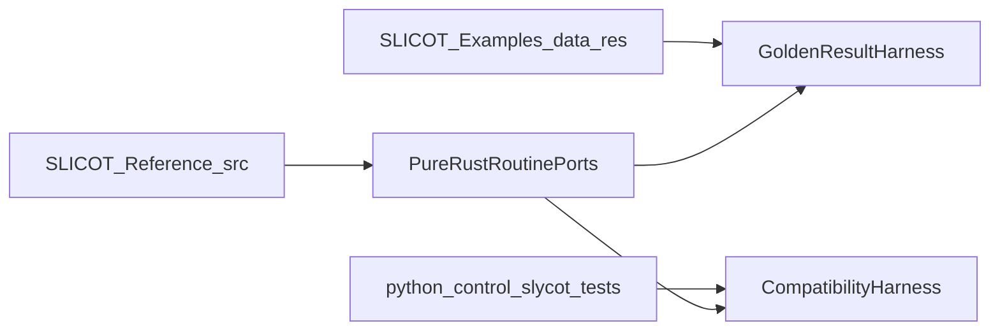

# Pure Rust SLICOT Port Plan

## Scope

Implement SLICOT in phases, starting with the routines already exercised by `python-control`, then expanding toward full library coverage. Validation must pass against both the upstream example/reference-result corpus in [`/projects/vibe_/control-rs/SLICOT-Reference/examples`](/projects/vibe_/control-rs/SLICOT-Reference/examples) and the Slycot-backed behavior tests in [`/projects/vibe_/control-rs/python-control/control/tests`](/projects/vibe_/control-rs/python-control/control/tests).

## Reference Inputs

- Treat [`/projects/vibe_/control-rs/SLICOT-Reference/src`](/projects/vibe_/control-rs/SLICOT-Reference/src) as the algorithmic oracle and routine inventory.
- Treat [`/projects/vibe_/control-rs/SLICOT-Reference/examples/readme`](/projects/vibe_/control-rs/SLICOT-Reference/examples/readme) plus `data/*.dat` and `results/*.res` as the upstream regression harness.
- Treat [`/projects/vibe_/control-rs/python-control/pyproject.toml`](/projects/vibe_/control-rs/python-control/pyproject.toml), [`/projects/vibe_/control-rs/python-control/control/tests/conftest.py`](/projects/vibe_/control-rs/python-control/control/tests/conftest.py), and [`/projects/vibe_/control-rs/python-control/control/tests/slycot_convert_test.py`](/projects/vibe_/control-rs/python-control/control/tests/slycot_convert_test.py) as the consumer-level compatibility oracle.

## Proposed Architecture

Create a new top-level Rust workspace rooted at [`/projects/vibe_/control-rs/Cargo.toml`](/projects/vibe_/control-rs/Cargo.toml) with dedicated crates for numerical kernels, SLICOT routines, and regression tooling.

Recommended initial layout:

- [`/projects/vibe_/control-rs/crates/slicot-linalg`](/projects/vibe_/control-rs/crates/slicot-linalg): pure-Rust linear algebra kernels and decomposition wrappers needed by SLICOT algorithms.
- [`/projects/vibe_/control-rs/crates/slicot-routines`](/projects/vibe_/control-rs/crates/slicot-routines): routine-level ports grouped by chapter/family.
- [`/projects/vibe_/control-rs/crates/slicot-test-harness`](/projects/vibe_/control-rs/crates/slicot-test-harness): parsers/runners for upstream example inputs and expected outputs.
- [`/projects/vibe_/control-rs/tests`](/projects/vibe_/control-rs/tests): integration tests that replay upstream cases and consumer-facing compatibility cases.

## Phase Breakdown

### Phase 1: Workspace and Test Infrastructure

- Stand up the Rust workspace and CI/test layout.
- Build parsers for SLICOT example inputs/results so each upstream `T*.f` example can be mirrored as a Rust regression test.
- Add a Python-driven compatibility harness that runs selected `python-control` Slycot tests against Rust outputs or a thin comparison layer.

### Phase 2: High-Value `python-control` Subset

Implement the first routine wave based on what `python-control` depends on most heavily:

- Matrix equations from [`/projects/vibe_/control-rs/python-control/control/mateqn.py`](/projects/vibe_/control-rs/python-control/control/mateqn.py): `SB02MD`, `SB02MT`, `SB03MD`, `SB03OD`, `SB04MD`, `SB04QD`, `SG02AD`, `SG03AD`.
- State feedback and realization routines from [`/projects/vibe_/control-rs/python-control/control/statefbk.py`](/projects/vibe_/control-rs/python-control/control/statefbk.py) and [`/projects/vibe_/control-rs/python-control/control/statesp.py`](/projects/vibe_/control-rs/python-control/control/statesp.py): `SB01BD`, `AB08ND`, `TB01PD`, `TB04AD`, `TB05AD`, `TD04AD`.
- Model reduction and norms from [`/projects/vibe_/control-rs/python-control/control/modelsimp.py`](/projects/vibe_/control-rs/python-control/control/modelsimp.py) and [`/projects/vibe_/control-rs/python-control/control/sysnorm.py`](/projects/vibe_/control-rs/python-control/control/sysnorm.py): `AB09AD`, `AB09MD`, `AB09ND`, `AB13BD`, `AB13DD`, `AB13MD`.
- Secondary synthesis/canonical routines from [`/projects/vibe_/control-rs/python-control/control/robust.py`](/projects/vibe_/control-rs/python-control/control/robust.py) and [`/projects/vibe_/control-rs/python-control/control/canonical.py`](/projects/vibe_/control-rs/python-control/control/canonical.py): `SB10AD`, `SB10HD`, `MB03RD`.

### Phase 3: Full SLICOT Expansion

- Enumerate remaining user-callable routines from [`/projects/vibe_/control-rs/SLICOT-Reference/README.md`](/projects/vibe_/control-rs/SLICOT-Reference/README.md) and the `src/` routine tree by chapter.
- Port chapter-by-chapter, preserving routine names and numerical behavior first, then layer ergonomic Rust APIs on top.
- Keep every new routine blocked on an upstream-example parity test before moving to the next batch.

## Validation Strategy

- For each ported routine, create a one-to-one Rust regression derived from the corresponding upstream example input/result pair.
- For each ported `python-control` routine family, add compatibility checks that compare Rust results to `slycot`-backed outputs across the existing consumer tests.
- Start with tight numeric tolerances that reflect the upstream `.res` files, then document any routine-specific tolerance relaxations when pure-Rust decomposition differences are unavoidable.

## Key Risks

- SLICOT relies heavily on LAPACK/BLAS-grade building blocks; pure Rust means the plan must either implement or adopt robust Rust-native Schur, QZ, QR, SVD, Sylvester, Lyapunov, and Riccati primitives before many high-level routines are safe.
- Some current `python-control` Slycot tests already document edge-case behavior and known tolerance/pathology issues, so parity will require reproducing behavior, not just mathematically equivalent outputs.
- Full-library coverage is large enough that routine inventorying and test-harness automation should be treated as first-class deliverables, not incidental setup.
